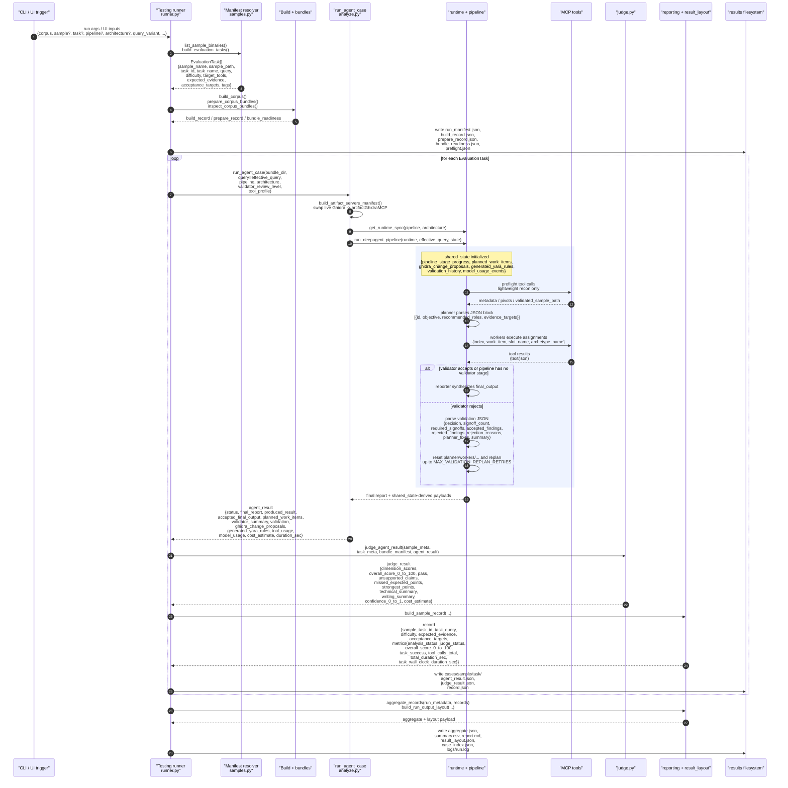

# Default Agent Run Dataflow

This document maps the implementation-grounded data flow for a normal run of the agent pipeline in this repo.

Scope:

- The runtime-default pipeline shown here is the fallback resolved in [`multi_agent_wf/config.py`](../multi_agent_wf/config.py): `preflight_planner_workers_validators_reporter`.
- The default runtime worker architecture shown here is the fallback in [`multi_agent_wf/config.py`](../multi_agent_wf/config.py): `aws_collaboration`.
- The testing harness can override both per run. For example, the experimental corpus baseline in [`Testing/harness/samples.py`](../Testing/harness/samples.py) and [`Testing/config/experiment_sweeps.json`](../Testing/config/experiment_sweeps.json) uses `auto_triage` + `balanced`.
- The second diagram shows the testing/evaluation wrapper around `run_agent_case()`, which is the path that writes judged results and aggregate artifacts.

Editable sources:

- [docs/diagrams/default_pipeline_overview.mmd](diagrams/default_pipeline_overview.mmd)
- [docs/diagrams/default_pipeline_sequence.mmd](diagrams/default_pipeline_sequence.mmd)

The Mermaid blocks in this document and the `.mmd` source files above are the
canonical diagrams. Rendered SVG exports are not maintained separately.

## Diagram 1. Runtime Default Pipeline Overview

```mermaid
flowchart LR
    classDef stage fill:#eef3ff,stroke:#355caa,stroke-width:1.5,color:#14233c;
    classDef data fill:#fff8e6,stroke:#b7791f,stroke-width:1.2,color:#3b2f14;
    classDef store fill:#edf7ed,stroke:#2f855a,stroke-width:1.2,color:#173b2d;
    classDef ext fill:#f7f0ff,stroke:#6b46c1,stroke-width:1.2,color:#2c1c54;
    classDef decision fill:#ffecec,stroke:#b83232,stroke-width:1.5,color:#4a1919;

    req["User request<br/>user_text"]:::data
    env["Runtime settings<br/>DEEP_AGENT_PIPELINE_NAME<br/>DEEP_AGENT_ARCHITECTURE_NAME<br/>validator_review_level<br/>shell_execution_mode"]:::data
    presets["Workflow config JSON<br/>pipeline_presets.json<br/>architecture_presets.json<br/>stage_kind_metadata.json<br/>stage_output_contracts.json"]:::store
    runtime["get_runtime_sync(...)<br/>MultiAgentRuntime<br/>{pipeline_name,<br/> worker_architecture_name,<br/> stages[],<br/> static_tool_ids,<br/> dynamic_tool_ids,<br/> sandbox_tool_ids}"]:::stage
    prompt["build_stage_prompt()<br/>stage input payload<br/>{user_text,<br/> prior_stage_outputs,<br/> stage contract,<br/> architecture,<br/> shared_state}"]:::data
    shared["shared_state<br/>{validated_sample_path,<br/> pipeline_stage_progress,<br/> planned_work_items,<br/> planned_work_item_status,<br/> ghidra_change_proposals,<br/> generated_yara_rules,<br/> validation_history,<br/> model_usage_events,<br/> final_output}"]:::store

    preflight["preflight<br/>light tool-backed reconnaissance<br/>output: short handoff<br/>+ validated_sample_path"]:::stage
    planner["planner<br/>planning only<br/>output text + JSON block<br/>[{id, objective,<br/> recommended_roles,<br/> evidence_targets}]"]:::stage
    workers["workers<br/>host-parallel assignment execution<br/>assignment payload:<br/>{index, work_item,<br/> slot_name, archetype_name}<br/>output: evidence bundle<br/>+ optional GHIDRA/YARA proposal blocks"]:::stage
    validators["validators<br/>review only<br/>output JSON gate<br/>{decision, signoff_count,<br/> required_signoffs,<br/> accepted_findings,<br/> rejected_findings,<br/> rejection_reasons,<br/> planner_fixes, summary}"]:::decision
    reporter["reporter<br/>synthesis only<br/>output: final report<br/>+ optional finalized proposal blocks"]:::stage
    tools["MCP tool layer<br/>artifact/live Ghidra, strings,<br/>FLOSS, capa, hashdb, yara, ...<br/>request: {tool_name, args}<br/>response: text/json"]:::ext
    final["Pipeline return<br/>final_output string<br/>shared_state snapshots<br/>status_log + tool_log_sections"]:::data

    req --> runtime
    env --> runtime
    presets --> runtime
    runtime --> prompt
    req --> prompt
    shared --> prompt

    prompt --> preflight
    preflight <--> shared
    preflight -->|"preflight handoff"| planner

    prompt --> planner
    planner <--> shared
    planner -->|"planned_work_items"| workers

    prompt --> workers
    workers <--> shared
    workers <--> tools
    workers -->|"worker evidence bundle"| validators

    prompt --> validators
    validators <--> shared
    validators -->|"accept"| reporter
    validators -.->|"reject + planner_fixes<br/>reset planner/workers/...<br/>replan up to MAX_VALIDATION_REPLAN_RETRIES"| planner

    prompt --> reporter
    reporter <--> shared
    reporter --> final
```



Implementation map:

- Runtime defaults and pipeline/architecture resolution: [`multi_agent_wf/config.py`](../multi_agent_wf/config.py)
- Stage list and models: [`multi_agent_wf/workflow_config/pipeline_presets.json`](../multi_agent_wf/workflow_config/pipeline_presets.json)
- Worker slots: [`multi_agent_wf/workflow_config/architecture_presets.json`](../multi_agent_wf/workflow_config/architecture_presets.json)
- Stage capability flags: [`multi_agent_wf/workflow_config/stage_kind_metadata.json`](../multi_agent_wf/workflow_config/stage_kind_metadata.json)
- Stage output contracts: [`multi_agent_wf/workflow_config/stage_output_contracts.json`](../multi_agent_wf/workflow_config/stage_output_contracts.json)
- Runtime assembly and tool partitioning: [`multi_agent_wf/runtime.py`](../multi_agent_wf/runtime.py)
- Pipeline loop, planner parsing, worker scheduling, validation replan loop: [`multi_agent_wf/pipeline.py`](../multi_agent_wf/pipeline.py)

Notes:

- `planner`, `validators`, and `reporter` are configured as tool-free stage kinds in [`multi_agent_wf/workflow_config/stage_kind_metadata.json`](../multi_agent_wf/workflow_config/stage_kind_metadata.json).
- `workers` can run host-managed parallel assignments. The host scheduler turns planner work items into assignment payloads shaped like `{index, work_item, slot_name, archetype_name}`.
- The validator loop is real, not illustrative. A reject decision rewinds the pipeline to the planner stage, clears downstream shared-state artifacts, and retries until `MAX_VALIDATION_REPLAN_RETRIES` is exhausted.

## Diagram 2. Evaluation Run Sequence and Result Emission



Implementation map:

- Task selection and manifest-backed payloads: [`Testing/harness/samples.py`](../Testing/harness/samples.py)
- Artifact-backed agent run wrapper: [`Testing/harness/analyze.py`](../Testing/harness/analyze.py)
- Judge payload and structured scoring result: [`Testing/harness/judge.py`](../Testing/harness/judge.py)
- Per-task record and aggregate metrics: [`Testing/harness/reporting.py`](../Testing/harness/reporting.py)
- Run orchestration and result writes: [`Testing/harness/runner.py`](../Testing/harness/runner.py)
- Inspection-oriented output layout: [`Testing/harness/result_layout.py`](../Testing/harness/result_layout.py)
- Result tree description: [`Testing/results/README.md`](../Testing/results/README.md)

## Stage and Payload Checklist

### 1. Preflight

- Code: [`multi_agent_wf/pipeline.py`](../multi_agent_wf/pipeline.py), [`multi_agent_wf/workflow_config/stage_manager_prompts.json`](../multi_agent_wf/workflow_config/stage_manager_prompts.json), [`multi_agent_wf/workflow_config/stage_output_contracts.json`](../multi_agent_wf/workflow_config/stage_output_contracts.json)
- Reads:
  - `user_text`
  - `shared_state` execution context
  - available tool IDs from `MultiAgentRuntime`
- Writes:
  - `validated_sample_path`
  - a short stage handoff in `pipeline_stage_outputs`

### 2. Planner

- Code: [`multi_agent_wf/pipeline.py`](../multi_agent_wf/pipeline.py), especially `extract_planned_work_items()` and `update_planned_work_items_from_planner_output()`
- Reads:
  - `user_text`
  - prior preflight output
- Writes:
  - free-text plan
  - machine-readable work items:

```json
[
  {
    "id": "W1",
    "objective": "Recover the dispatcher logic",
    "recommended_roles": ["ghidra_analyst"],
    "evidence_targets": ["dispatcher function", "handler xrefs"]
  }
]
```

### 3. Workers

- Code: [`multi_agent_wf/pipeline.py`](../multi_agent_wf/pipeline.py), especially `_plan_host_worker_assignments()`, `_build_host_worker_prompt()`, and `_run_host_parallel_worker_stage()`
- Reads:
  - planner work items
  - narrowed `prior_stage_outputs`
  - shared evidence already collected
- Writes:
  - worker evidence bundle text
  - per-assignment timing and model-usage events
  - optional machine-readable proposal blocks consumed later by host-side Ghidra/YARA handlers

Assignment shape:

```json
{
  "index": 1,
  "work_item": {
    "id": "W1",
    "objective": "Recover the dispatcher logic",
    "recommended_roles": ["ghidra_analyst"],
    "evidence_targets": ["dispatcher function", "handler xrefs"]
  },
  "slot_name": "ghidra_analyst",
  "archetype_name": "ghidra_analyst"
}
```

### 4. Validators

- Code: [`multi_agent_wf/pipeline.py`](../multi_agent_wf/pipeline.py), especially `extract_validation_gate()`
- Reads:
  - planner output
  - worker bundle
  - current validation retry state
- Writes:
  - accept/reject gate
  - `validation_history`
  - replan feedback used to restart the planner when rejected

Gate shape:

```json
{
  "decision": "accept",
  "signoff_count": 2,
  "required_signoffs": 2,
  "accepted_findings": ["Dispatcher recovered"],
  "rejected_findings": [],
  "rejection_reasons": [],
  "planner_fixes": [],
  "summary": "Core request is adequately supported."
}
```

### 5. Reporter and Final Outputs

- Code: [`multi_agent_wf/pipeline.py`](../multi_agent_wf/pipeline.py)
- Reads:
  - validated upstream findings only
- Writes:
  - final user-facing report string
  - final proposal blocks
  - `shared_state["final_output"]`

### 6. Judge, Records, and Filesystem Artifacts

- Code: [`Testing/harness/judge.py`](../Testing/harness/judge.py), [`Testing/harness/reporting.py`](../Testing/harness/reporting.py), [`Testing/harness/result_layout.py`](../Testing/harness/result_layout.py)
- Writes per sample-task:
  - `agent_result.json`
  - `judge_result.json`
  - `record.json`
- Writes per run:
  - `aggregate.json`
  - `summary.csv`
  - `report.md`
  - `result_layout.json`
  - `case_index.json`
  - `logs/run.log`

## Downstream Sweep Note

If the run is launched by [`Testing/scripts/run_experiment_sweep.py`](../Testing/scripts/run_experiment_sweep.py), the sequence above becomes the child-run unit. The sweep layer then adds:

- experiment-level `experiment_manifest.json`
- experiment-local child runs under `runs/<variant_id>/r001/`, `r002/`, and so on
- experiment-wide comparison outputs such as `comparison.json`, `variant_summary.csv`, significance tables, timing summaries, and `outputs/*.png`

That sweep wrapper does not change the internal `run_deepagent_pipeline()` stage loop; it repeats it across configuration variants and replicates.
